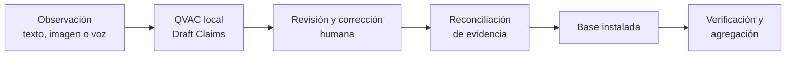

# Philips Customer Installed Base Intelligence

Convierte observaciones de campo en evidencia estructurada y revisable para entender la base instalada sin sacar la inferencia del computador ni perder el control humano.

## El problema

Las observaciones sobre equipos hospitalarios suelen quedar en notas de campo sin estructura. Eso produce información incompleta e incierta y puede duplicar equipos cuando una nueva nota describe un activo ya registrado.

## La solución

**Observación → extracción local con IA → revisión y corrección humana → reconciliación de evidencia → visibilidad de la base instalada → verificación y agregación.**

La aplicación conserva la nota original, propone datos como *Draft Claims* y exige que una persona decida qué aceptar, corregir o rechazar. La evidencia aceptada puede vincularse explícitamente a un equipo existente; una observación nunca crea ni modifica automáticamente un registro de equipo.

## Por qué QVAC es esencial

- Toda inferencia evaluada se ejecuta localmente, en el mismo computador, mediante `@qvac/sdk` 0.19.0.
- Las notas operativas sensibles no necesitan enviarse a un servicio de inferencia en la nube.
- Después de instalar dependencias y disponer de los modelos, el flujo funciona sin internet.
- `QWEN3_1_7B_INST_Q4` (Qwen3 1.7B, Q4_0) convierte observaciones no estructuradas en *Draft Claims* y también interpreta preguntas de consulta en un plan seguro de solo lectura.
- `WHISPER_TINY_Q8_0` (Whisper Tiny multilingüe, Q8_0) realiza la transcripción local de voz.
- Código determinista valida contratos, conserva evidencia, reconcilia decisiones humanas y calcula agregados permitidos.
- QVAC nunca modifica automáticamente los registros de equipos.

La captura por imagen es una ruta separada: usa **Tesseract.js 7.0.0** con datos `eng` y `spa` locales. Tesseract.js hace OCR; QVAC hace la extracción semántica posterior.

## Funcionalidades

- Captura de observaciones por texto, imagen y voz dentro de una misma tarjeta.
- Extracción local de tipo de equipo, fabricante, modelo, cantidad, alcance, ubicación, fuente, certeza y evidencia.
- Una aclaración material acotada, seguida siempre por revisión humana.
- Aprobación, rechazo y corrección con valor original, procedencia e historial preservados.
- Sugerencia de duplicados y vinculación explícita a equipos existentes, sin fusión automática.
- Vistas de registros verificados/provisionales, evidencia no vinculada, frescura y verificaciones priorizadas.
- Confianza explicable y oportunidades conservadoras calculadas de forma determinista.
- Consultas en lenguaje natural de solo lectura y agregados permitidos.
- Mapa geográfico esquemático, local y sintético, sin mapas ni geocodificación externos.
- Exportación JSON, eliminación confirmada y restablecimiento del Workspace sintético.
- Voz: **Implementada; pendiente de validación manual con micrófono físico en Chrome/Edge.**

## Cómo funciona



## Arquitectura

La interfaz se sirve en el navegador. Un host Node.js escucha únicamente en `127.0.0.1`, coordina los modelos QVAC locales y persiste un único Workspace JSON local. La validación, la reconciliación y los agregados son deterministas; la salida del modelo permanece como propuesta hasta una decisión humana.

## Privacidad

El repositorio y la demostración usan exclusivamente datos sintéticos. No hay inferencia en la nube. Las imágenes y el audio se procesan mediante archivos temporales locales que se eliminan tanto al completar como al fallar; el audio original nunca se persiste ni se exporta. El usuario puede exportar el Workspace a JSON y eliminarlo con confirmación explícita. Esta es evidencia acotada de un prototipo, no una auditoría de seguridad.

## Inicio rápido

Requisitos: Windows, Node.js **22.17.0**, npm **10.9.0 o posterior**, y un entorno compatible con la configuración GPU local del prototipo. La primera instalación y la adquisición de activos requieren internet; después se usan cachés locales fuera de Git.

```powershell
git clone https://github.com/DanielMes888/qvac-installed-base-intelligence.git
Set-Location qvac-installed-base-intelligence
npm.cmd ci
npm.cmd run feasibility:ocr:tesseract:acquire
npm.cmd run feasibility:transcription
npm.cmd run reset
npm.cmd start
```

`npm.cmd start` carga `QWEN3_1_7B_INST_Q4` mediante el SDK y lo adquiere si aún no está en la caché. `feasibility:transcription` prepara/comprueba `WHISPER_TINY_Q8_0` con el fixture sintético y actualiza su resultado de factibilidad; omítalo si no va a probar voz. La adquisición de Tesseract descarga únicamente los datos `eng` y `spa`, verifica tamaño y SHA-256 y los guarda bajo `.local/`.

Con el servidor activo, abra otra ventana de PowerShell:

```powershell
Start-Process 'http://127.0.0.1:4173'
```

Espere a ver `Prototipo listo en http://127.0.0.1:4173`. Si el puerto está ocupado, el servidor muestra cómo elegir otro puerto de loopback.

## Validación

| Tipo | Comando | Qué demuestra |
| --- | --- | --- |
| Suite normal | `npm.cmd test` | Contratos, Workspace, revisión, reconciliación, vistas y límites. La suite actual también contiene una integración local real con Whisper Tiny; no es una suite puramente determinista. |
| Smoke principal con modelo real | `npm.cmd run smoke:demo` | Recorrido HTTP con Qwen v9 real, revisión y reconciliación. |
| Modelo real opcional | `npm.cmd run smoke:clarification` | Pregunta acotada y segunda inferencia local. |
| Modelo real opcional | `npm.cmd run smoke:analytics:real` | Interpretación local de consultas de solo lectura. |
| Voz real opcional | `npm.cmd run smoke:voice` | Fixture WAV sintético con Whisper Tiny; no valida un micrófono físico. |
| Deterministas | `npm.cmd run smoke:correction`, `smoke:confidence`, `smoke:opportunities`, `smoke:analytics`, `smoke:geography`, `smoke:freshness`, `smoke:export-delete` | Reglas y flujos controlados sin evaluar extracción Qwen. |
| OCR local opcional | `npm.cmd run smoke:photo` | Fixture de imagen sintético con Tesseract.js local. |

Los smokes con modelos reales pueden tardar, requieren sus activos en caché y regeneran evidencia versionada. Consulte la [guía de demostración](docs/DEMO_GUIDE.md) antes de ejecutarlos.

## Resultados demostrados

Resultados reproducibles y acotados del benchmark sintético QVAC v9 de **5 casos**:

- Esquema válido: **5/5**; checklist semántico: **5/5**; identidades o cantidades no respaldadas: **0**.
- Cinco extracciones calientes: **578.72–855.50 ms**; mediana: **600.34 ms** en el equipo documentado.
- Aclaración: **1/1** caso ambiguo produjo una pregunta útil. El segundo análisis no incorporó la respuesta como total explícito y mantuvo desconocido el alcance de cantidad.
- Prevención de duplicados: el smoke principal vinculó evidencia al MRI existente y Northbridge conservó **2** registros antes y después.
- Evidencia local/offline: con activos ya almacenados y una sonda externa sin acceso, el flujo completó carga, inferencia, revisión, reconciliación y agregación. La observación cubrió límites instrumentados, no una auditoría de red del sistema operativo.

Detalles, configuración y límites: [informe del prototipo](results/emergency/PROTOTYPE_REPORT.md).

## Limitaciones

- Las evaluaciones formales **E4 y E4-v2 fallaron**; el prototipo existe por una excepción de tiempo documentada.
- El benchmark es sintético, pequeño y ajustado; no mide exactitud general.
- Es un prototipo para un solo computador y un solo usuario, con almacenamiento JSON local.
- Solo se usan datos sintéticos; no se ha validado con datos hospitalarios reales.
- La transcripción con micrófono físico sigue pendiente de validación manual en Chrome/Edge.
- No existe validación de seguridad de producción ni del flujo oficial de trabajo de Philips.

## Estructura del repositorio

| Ruta | Contenido |
| --- | --- |
| `public/` | Interfaz web y lógica de captura en navegador. |
| `src/` | Host loopback, dominio, Workspace y adaptadores locales. |
| `data/` | Semillas y casos sintéticos. |
| `scripts/` | Factibilidad, adquisición reproducible, benchmarks y smokes. |
| `test/` | Pruebas y fixtures sintéticos. |
| `docs/` | Plan, decisiones, guías, especificaciones y tickets. |
| `results/` | Evidencia versionada de factibilidad, benchmarks y smokes. |

## Documentación

- [Plan oficial del proyecto](docs/OFFICIAL_PROJECT_PLAN.md)
- [Guía de demostración](docs/DEMO_GUIDE.md)
- [Estado del prototipo de emergencia](docs/EMERGENCY_DEMO_STATUS.md)
- [Informe del prototipo](results/emergency/PROTOTYPE_REPORT.md)
- [Matriz de cumplimiento](docs/COMPLIANCE_MATRIX.md)
- [Brief del reto Philips](docs/references/PHILIPS_CHALLENGE_BRIEF.docx)
- Decisiones: [alcance de evidencia](docs/adr/0001-preserve-evidence-scope-separately-from-asset-identity.md), [Workspace local](docs/adr/0002-limit-mvp-to-one-local-workspace.md), [QVAC en el computador](docs/adr/0003-run-qvac-on-the-workspace-computer.md), [extracción semántica](docs/adr/0005-qvac-owns-semantic-extraction.md) y [excepción del prototipo](docs/adr/0006-use-time-constrained-browser-prototype.md).

## Licencias

El código del proyecto se publica bajo [Apache License 2.0](LICENSE). La documentación existente conserva el alcance y las fuentes revisadas para [QVAC](docs/references/QVAC_PLATFORM_RESEARCH.md), [Tesseract.js y sus datos OCR](docs/OCR_ACQUISITION_AND_LICENSE.md) y [Whisper Tiny](results/feasibility/TRANSCRIPTION_FEASIBILITY_REPORT.md). Los pesos se mantienen fuera del repositorio; estas referencias no sustituyen una revisión legal ni otorgan derechos no documentados por sus fuentes.
